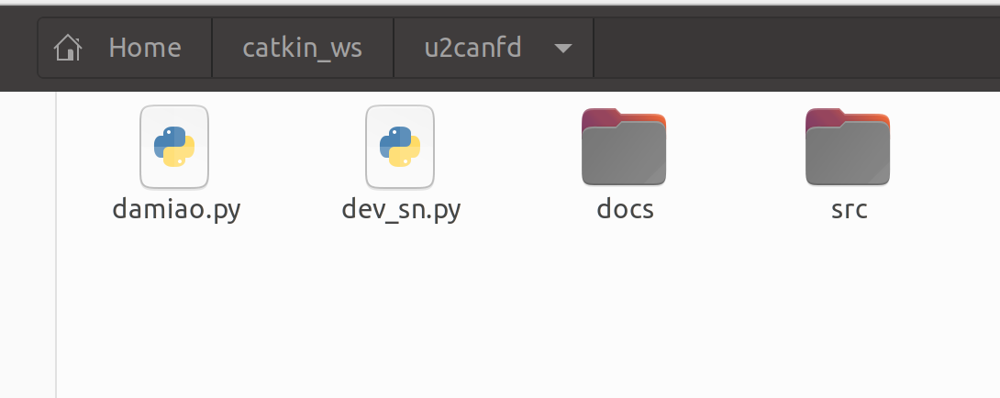
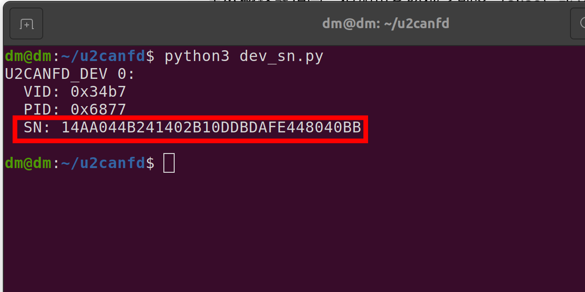

# 使用USB转CANFD驱动达妙电机，python例程

## 介绍
这是控制达妙电机的python例程。

硬件设备需要达妙的**USB转CANFD设备**。

程序测试环境是**python3.8和python3.10** , 如果其他python版本运行不了，可以在QQ技术交流群1040315086联系管理员。

程序默认运行的效果是先让canid为0x01、mstid为0x11的DM4310电机控制模式设置为速度模式，然后使能，然后旋转，**电机波特率为5M**。

***注意：5M波特率下，电机有多个时，需要在末端电机接一个120欧的电阻***

## 软件架构
python

## 安装和编译
打开终端，先安装python版本的libusb库，输入：
```shell
pip3 install pyusb
```
然后打开终端，输入：
```shell
mkdir -p ~/catkin_ws
cd ~/catkin_ws
```
然后把gitee上的**u2canfd**文件夹放到catkin_ws目录下。

如下所示：



## 简单使用
首先用最新上位机给电机设置5M波特率。

然后给**USB转CANFD设备**设置权限，在终端输入：

***注意：mac和windows系统不需要设置权限***

```shell
sudo nano /etc/udev/rules.d/99-usb.rules
```
然后写入内容：
```shell
SUBSYSTEM=="usb", ATTR{idVendor}=="34b7", ATTR{idProduct}=="6877", MODE="0666"
```
然后重新加载并触发：
```shell
sudo udevadm control --reload-rules
sudo udevadm trigger
```
***注意：这个设置权限只需要设置1次就行，重新打开电脑、插拔设备都不需要重新设置**

然后需要通过运行dev\_sn.py文件找到**USB转CANFD设备**的Serial_Number:
```shell
cd ~/catkin_ws/u2canfd
python3 dev_sn.py
```


上面图片里的SN后面的一串数字就是该设备的的Serial_Number，

接着复制该Serial\_Number，打开damiao.py，替换程序里的Serial\_Number,如下图所示：


然后打开终端运行damiao.py文件:
```shell
cd ~/catkin_ws/u2canfd
python3 damiao.py
```
此时你会发现电机亮绿灯，并且旋转

## 进阶使用
下面手把手教你怎么使用这个程序，实现功能是使用5M波特率，1kHz同时控制9个DM4310电机

***注意：在windows或者mac系统上控制多个电机时。最好开启多个发送线程分别调用发送电机控制命令函数***

***注意：5M波特率下，电机有多个时，需要在末端电机接一个120欧的电阻***

1. 首先用最新上位机给每个电机设置5M波特率。

2. 然后在main函数里定义id变量：
```shell
canid1=0x01
mstid1=0x11
canid2=0x02
mstid2=0x12
canid3=0x03
mstid3=0x13
canid4=0x04
mstid4=0x14
canid5=0x05
mstid5=0x15
canid6=0x06
mstid6=0x16
canid7=0x07
mstid7=0x17
canid8=0x08
mstid8=0x18
canid9=0x09
mstid9=0x19
```
3. 然后定义一个电机信息列表：
```shell
init_data1= []
```
4. 然后再用9个电机数据对该容器进行填充：
```shell
init_data1.append(DmActData(
                    motorType=DM_Motor_Type.DM4310,  
                    mode=Control_Mode.POS_VEL_MODE,      
                    can_id=canid6,
                    mst_id=mstid6))
        init_data1.append(DmActData(
                    motorType=DM_Motor_Type.DM4310,  
                    mode=Control_Mode.POS_VEL_MODE,       
                    can_id=canid2,
                    mst_id=mstid2))
        init_data1.append(DmActData(
                    motorType=DM_Motor_Type.DM4310, 
                    mode=Control_Mode.POS_VEL_MODE,      
                    can_id=canid3,
                    mst_id=mstid3))
        init_data1.append(DmActData(
                    motorType=DM_Motor_Type.DM4340, 
                    mode=Control_Mode.POS_VEL_MODE,        
                    can_id=canid4,
                    mst_id=mstid4))
        init_data1.append(DmActData(
                    motorType=DM_Motor_Type.DM4340, 
                    mode=Control_Mode.POS_VEL_MODE,       
                    can_id=canid5,
                    mst_id=mstid5))
        init_data1.append(DmActData(
                    motorType=DM_Motor_Type.DM4340,  
                    mode=Control_Mode.POS_VEL_MODE,       
                    can_id=canid6,
                    mst_id=mstid6))
        init_data1.append(DmActData(
                    motorType=DM_Motor_Type.DM4310,  
                    mode=Control_Mode.POS_VEL_MODE,      
                    can_id=canid7,
                    mst_id=mstid7))
        init_data1.append(DmActData(
                    motorType=DM_Motor_Type.DM4310, 
                    mode=Control_Mode.POS_VEL_MODE,      
                    can_id=canid8,
                    mst_id=mstid8))
        init_data1.append(DmActData(
                    motorType=DM_Motor_Type.DM4310, 
                    mode=Control_Mode.POS_VEL_MODE,      
                    can_id=canid9,
                    mst_id=mstid9))
```
6. 然后初始化电机控制结构体：
```shell
with Motor_Control(1000000, 5000000,"14AA044B241402B10DDBDAFE448040BB",init_data1) as control:
```
***注意：上面的"14AA044B241402B10DDBDAFE448040BB"是我设备的SN号，你要替换为你的SN号，通过运行dev_sn.py文件就可以找到你设备的SN号，前面也提到过***

7. 接下来就可以通过该结构体对电机进行控制，给9个电机发mit命令：
```shell
control.control_mit(control.getMotor(canid1), 0.0, 0.0, 0.0, 0.0, 0.0)
control.control_mit(control.getMotor(canid2), 0.0, 0.0, 0.0, 0.0, 0.0)
control.control_mit(control.getMotor(canid3), 0.0, 0.0, 0.0, 0.0, 0.0)
control.control_mit(control.getMotor(canid4), 0.0, 0.0, 0.0, 0.0, 0.0)
control.control_mit(control.getMotor(canid5), 0.0, 0.0, 0.0, 0.0, 0.0)
control.control_mit(control.getMotor(canid6), 0.0, 0.0, 0.0, 0.0, 0.0)
control.control_mit(control.getMotor(canid7), 0.0, 0.0, 0.0, 0.0, 0.0)
control.control_mit(control.getMotor(canid8), 0.0, 0.0, 0.0, 0.0, 0.0)
control.control_mit(control.getMotor(canid9), 0.0, 0.0, 0.0, 0.0, 0.0)
```
8. 获取9个电机的位置、速度、力矩还有接收到电机反馈的数据的时间间隔：
```shell
for id in range(1,10): 
	pos = control.getMotor(id).Get_Position()
	vel = control.getMotor(id).Get_Velocity()
	tau = control.getMotor(canid1).Get_tau()
	interval = control.getMotor(id).getTimeInterval()

	print(f"canid is: {id} pos: {pos} vel: {vel} effort: {tau} time(s): {interval}", file=sys.stderr)
```
9. 1kHz的控制频率实现：

***注意：这样比较好***
```shell
while running.is_set():
    desired_duration = 0.001  # 秒
    current_time = time.perf_counter()
   
   
    sleep_till = current_time + desired_duration
    now = time.perf_counter()
    if sleep_till > now:
        time.sleep(sleep_till - now)
```

## 接收函数说明

在damiao.py里的canframeCallback(self, value:can\_value_type)，

这个函数是对接收到的can报文的解析，不能主动调用，他是作为参数传入到usb_class这个类，在usb\_class类里会开启线程调用该函数，

你可以重写这个函数解析自己的can报文数据

can\_value_type数据类型是这样定义的
```shell
class can_head_type:
    def __init__(self):
        self.id = 0
        self.time_stamp = 0
        self.reserve = [0, 0, 0]
        self.fram_type = 0
        self.can_type = 0
        self.id_type = 0
        self.dir = 0
        self.dlc = 0  # 4 bits, stored in lower nibble

class can_value_type:
    def __init__(self):
        self.head = can_head_type()
        self.data = [0] * 64
```


